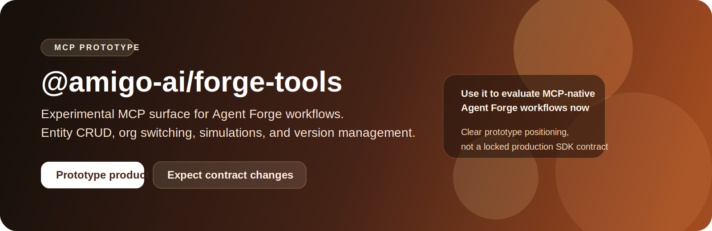
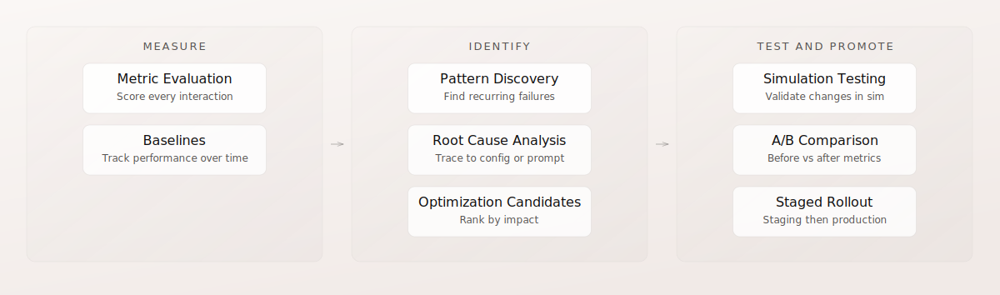

<p align="center">
  
</p>

<h1 align="center">@amigo-ai/forge-tools</h1>

<p align="center">Prototype MCP server for Amigo Agent Forge workflows.</p>

<p align="center">
  <a href="https://docs.amigo.ai">Product Docs</a>
  ·
  <a href="https://github.com/amigo-ai/forge-mcp/issues">GitHub Issues</a>
  ·
  <a href="https://github.com/amigo-ai/forge-mcp/blob/main/CONTRIBUTING.md">Contributing</a>
  ·
  <a href="https://github.com/amigo-ai/forge-mcp/blob/main/SECURITY.md">Security</a>
</p>

<p align="center">
  <a href="https://www.npmjs.com/package/@amigo-ai/forge-tools"></a>
  <a href="https://github.com/amigo-ai/forge-mcp/actions/workflows/test.yml"></a>
  <a href="https://github.com/amigo-ai/forge-mcp/actions/workflows/publish.yml"></a>
</p>

This package gives coding agents access to current Amigo Agent Forge operations: managing org credentials, reading and mutating entity configurations, running conversation tests, and working with version sets from Claude Code, Codex, Cursor, and other MCP clients.

> Prototype status
>
> `@amigo-ai/forge-tools` is an experimental product under active development. Expect rough edges, changing tool contracts, and a faster-moving surface than a locked production SDK. Use it for evaluation and early workflows, not as a long-term stability guarantee.

## Prototype Context

Forge MCP is the agent-facing bridge for current Agent Forge workflows. It is useful when a coding agent needs an MCP surface for org switching, entity CRUD, conversation simulation, and version-set operations.



For direct typed application integrations against the Platform API, use [`@amigo-ai/platform-sdk`](https://github.com/amigo-ai/amigo-platform-typescript-sdk).

## Documentation

| Need | Best entry point |
| --- | --- |
| Product and platform docs | [docs.amigo.ai](https://docs.amigo.ai/) |
| Prototype repo issues and feedback | [GitHub Issues](https://github.com/amigo-ai/forge-mcp/issues) |
| Contributor guidance | [CONTRIBUTING.md](https://github.com/amigo-ai/forge-mcp/blob/main/CONTRIBUTING.md) |
| Security reporting | [SECURITY.md](https://github.com/amigo-ai/forge-mcp/blob/main/SECURITY.md) |

## Installation

Add the server to your MCP configuration.

### Via npm

```json
{
  "mcpServers": {
    "forge": {
      "command": "npx",
      "args": ["-y", "@amigo-ai/forge-tools"]
    }
  }
}
```

### From GitHub

```json
{
  "mcpServers": {
    "forge": {
      "command": "npx",
      "args": ["-y", "github:amigo-ai/forge-mcp"]
    }
  }
}
```

### From a local clone

```bash
git clone git@github.com:amigo-ai/forge-mcp.git
cd forge-mcp
npm install
npm run build
```

```json
{
  "mcpServers": {
    "forge": {
      "command": "node",
      "args": ["/absolute/path/to/forge-mcp/dist/index.js"]
    }
  }
}
```

## Credentials

Credentials are stored per org in `~/.amigo/credentials/{org_id}.json`.

### Recommended flow

Start the server without environment variables, then ask your coding agent to add org credentials:

```text
Use forge_add_org to add credentials for org "acme"
Use forge_add_org to add credentials for org "acme-staging"
```

The tool validates credentials by signing in before saving them.

### Bootstrap with environment variables

You can bootstrap one org on startup:

```json
{
  "mcpServers": {
    "forge": {
      "command": "npx",
      "args": ["-y", "@amigo-ai/forge-tools"],
      "env": {
        "AMIGO_ORG_ID": "your-org",
        "AMIGO_API_KEY": "your-api-key",
        "AMIGO_API_KEY_ID": "your-api-key-id",
        "AMIGO_USER_ID": "your-user-id"
      }
    }
  }
}
```

## What your agent can do

- Add, remove, list, and switch active org credentials
- Create, update, read, list, and delete Agent Forge entity types
- Run smoke tests and multi-turn simulations
- Inspect conversation insights and evaluations
- Manage version sets and rollbacks

## Multi-org support

All tools accept an optional `org_id`. Resolution order is:

1. Explicit `org_id` on the tool call
2. Session org set by `forge_set_org`
3. Default org in `~/.amigo/config.json`

## Tool catalog

### Org management

| Tool | Description |
| --- | --- |
| `forge_set_org` | Set the active org for the session |
| `forge_list_orgs` | List configured orgs with auth status |
| `forge_add_org` | Add or update credentials for an org |
| `forge_remove_org` | Remove stored credentials |

### Entity CRUD

| Tool | Description |
| --- | --- |
| `forge_entity_list` | List entities of a type |
| `forge_entity_get` | Get full entity details |
| `forge_entity_create` | Create a new entity |
| `forge_entity_update` | Update an entity |
| `forge_entity_delete` | Delete an entity |

Supported entity types: `agent`, `context_graph`, `service`, `dynamic_behavior_set`, `tool`, `persona`, `scenario`, `metric`, `unit_test`, `unit_test_set`, `user_dimension`

### Conversation testing

| Tool | Description |
| --- | --- |
| `forge_smoke_test` | Quick single-turn test against a service |
| `forge_simulate` | Multi-turn automated simulation |
| `forge_conversation_insights` | Inspect state transitions and memory |
| `forge_conversation_evaluate` | Run on-demand metric evaluation |

### Version management

| Tool | Description |
| --- | --- |
| `forge_version_set_list` | List version sets for a service |
| `forge_version_set_upsert` | Create or update a version set |
| `forge_version_set_promote` | Promote one version set to another |
| `forge_version_rollback` | Roll back an entity to a previous version |

## MCP Resources

- `amigo://instructions` for Agent Forge guidance
- `amigo://dependency-order` for entity dependency ordering

## Environment Variables

All variables are optional and only apply to startup bootstrap:

| Variable | Description |
| --- | --- |
| `AMIGO_ORG_ID` | Org to bootstrap and set as session default |
| `AMIGO_API_KEY` | API key for the bootstrapped org |
| `AMIGO_API_KEY_ID` | API key identifier |
| `AMIGO_USER_ID` | User ID |
| `AMIGO_API_BASE_URL` | API base URL. Defaults to `https://api.amigo.ai` |
| `FORGE_LOG_LEVEL` | Log verbosity: `debug`, `info`, `warn`, `error` |

## Development

```bash
npm install
npm run build
npm run lint
npm test
```
